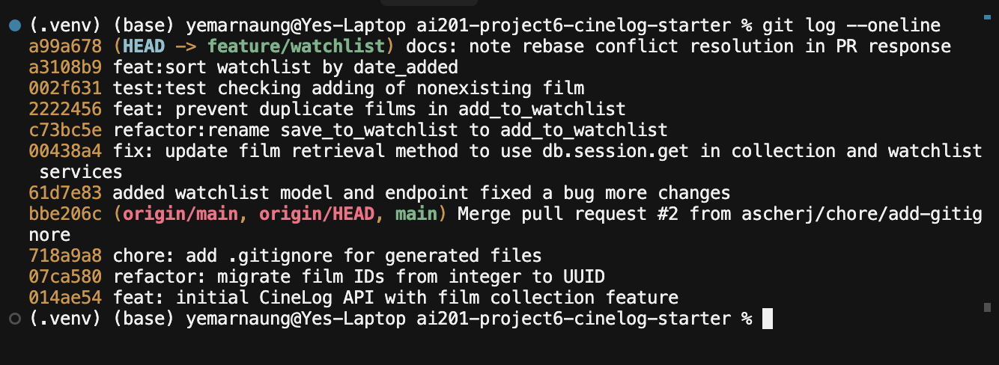

# PR Response Doc — CineLog Watchlist Feature

## AI Usage

I used Claude and Cursor to help me understand the codebase and search through and trace functions. 

I also used to help me write the code such as asking Claude to rename functions and change the name the function was called with also. 

I asked used Claude to help write the tests and as well as brainstorm ideas on if setting to public as default was a good idea and what sorting type would be suitable with WatchLists. 

I also used Claude to check the merge conflicts, but took the decision on how it should be solved. 

## Comment 1 — Rename
**What I did:** 
Asked Claude to rename save_to_watchlist() to add_to_watchlist() and update where the function is called also. 
**How I verified:**
grep -rn "save_to_watchlist" => to ensure that the old functiin name doesn't exist anywhere in the codebase

## Comment 2 — Deduplication
**What I did:** 
Checked how the deduplication is handled in add_to_collection() in services/collection_service.py. Copy the exact same logic for add_to_watchlist()
**How I verified:**
Verified by checking how close the implementation is to deduplication logic in add_to_collection(). 

## Comment 3 — Missing test
**What I did:**
Checked test_add_to_collection_nonexistent_film_raises and how the test operates. 
**How I verified:**
Ran pytest tests/test_watchlist.py -v and the test passed. 

## Comment 4 — Default visibility
**My position:** 
Prefer public=False by default.
**Reasoning:**
A “want to watch” list can feel personal; defaulting to private avoids surprising users with visibility. Social apps like Letterboxd often default public for community features, but I’d rather require an explicit opt-in to share.
**Tradeoff acknowledged:**
Users must opt in to be public, which may reduce discovery/sharing unless the UI makes that easy.

## Comment 5 — Sort order
**My position:** 
Prefer date_added descending
**Reasoning:**
Personal preference in a watchlist is with date_added. Keep currently interested movies at the top of the list. 
**Engagement with reviewer's point:**
Totally agreed. I can change the implmentation to date added instead. 

## Comment 6 — Rebase
**What conflicted:**
`.gitignore` — add/add conflict. `main` had added `.pytest_cache/` and branch had `.venv/` and `venv/`.
**How I resolved it:**
Kept both sides (`.pytest_cache/`, `.venv/`, and `venv/`), then `git add .gitignore` and `git rebase --continue`.
**How I verified no conflict remains:**
`git rebase` completed successfully with a clean working tree (`git status` showed no unmerged paths). `git log --oneline` shows a linear history with `feature/watchlist` commits on top of `origin/main` and no merge commits:

## PR Description

This PR adds a watchlist feature to CineLog, letting users save films they want to watch later. It introduces a `WatchlistEntry` model, service functions (`add_to_watchlist`, `get_watchlist`), and two endpoints: `GET /watchlist/<user_id>` and `POST /watchlist/<user_id>/add`. The implementation follows the same patterns as the existing collection feature.

**Review comments addressed:**
1. **Rename** — Renamed `save_to_watchlist()` to `add_to_watchlist()` and updated all call sites to match project naming conventions.
2. **Deduplication** — Added duplicate-check logic to `add_to_watchlist()`, raising `AlreadyInWatchlistError` when a film is already on the watchlist (same pattern as collection).
3. **Missing test** — Added `test_add_to_watchlist_nonexistent_film_raises` in `tests/test_watchlist.py`, mirroring the collection test for nonexistent film IDs.
4. **Default visibility** — Argued for `public=False` by default; watchlists feel personal and users should opt in to sharing rather than be public by default.
5. **Sort order** — Changed `get_watchlist()` to sort by `date_added` descending (newest first) instead of film title.
6. **Rebase** — Rebased onto `origin/main`; resolved a `.gitignore` add/add conflict by keeping entries from both branches.

**Design decisions:**
- Renamed `save_to_watchlist()` to `add_to_watchlist()` to match the project's `verb_to_noun` naming convention (e.g. `add_to_collection()`).
- Added deduplication in `add_to_watchlist()` — duplicate adds raise `AlreadyInWatchlistError`, mirroring collection behavior.
- `get_watchlist()` returns films sorted by `date_added` descending (newest first), consistent with `get_collection()`.
- Default visibility: I prefer `public=False` by default so watchlist entries are private unless the user opts in. Tradeoff: less automatic social discovery, but avoids surprising users with public visibility.

